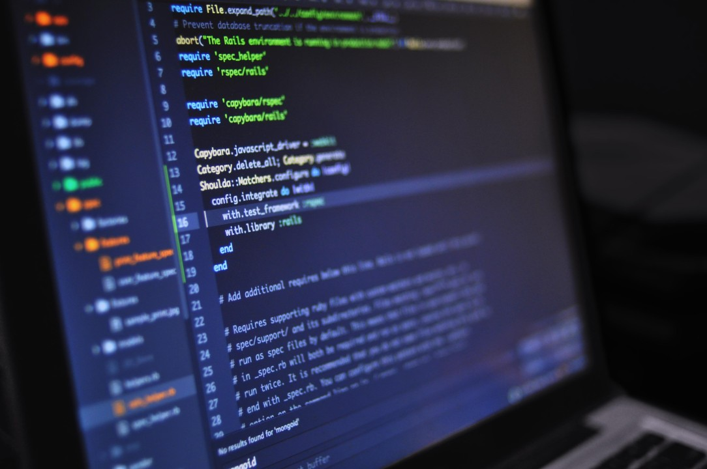

Software engineering has always excited me because it blends creativity with logical problem-solving. What I love about it is finding solutions to real-world problems, which can be incredibly rewarding. As technology grows, I’m drawn to the challenge of staying on top of new tools and trends in the field.

I hope to solidly grasp different programming languages like Python, Java, and C++ and become more comfortable with the frameworks and libraries that are commonly used today. I want to dig deeper into algorithms, data structures, and systems design to tackle more complex projects. I also want to improve my practical skills, such as debugging and testing.

I’m also really interested in working on team projects. Software development isn’t just about coding by myself—it’s about collaborating to get the best results. Learning to use version control, getting involved in code reviews, and understanding agile workflows will be important to becoming a well-rounded developer. I also want to get better at communicating and working well with others. There’s a lot to learn, but I’m excited to take it on and grow as a developer.
